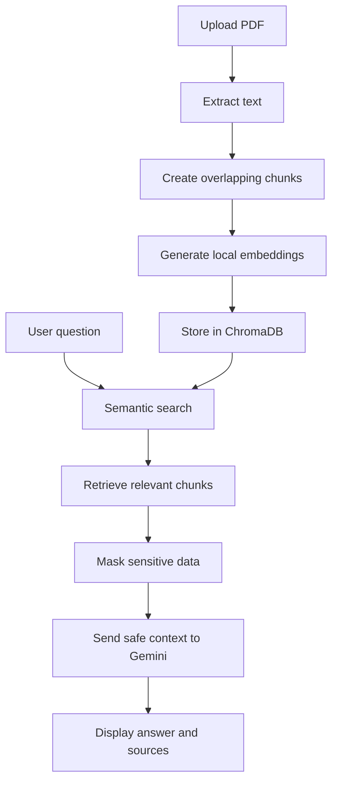

# Privacy-Aware Internal Document Assistant

A document question-answering application that allows users to upload PDF files and ask questions based on their contents.

The system uses local Hugging Face embeddings and ChromaDB for semantic document retrieval. Sensitive information is masked before relevant document content is sent to the Gemini API.

## Features

* Upload and extract text from PDF documents
* Split documents into overlapping text chunks
* Generate embeddings locally with Hugging Face Sentence Transformers
* Store and retrieve embeddings using ChromaDB
* Search only within the currently selected document
* Generate document-grounded answers using Gemini
* Mask emails, phone numbers, SSNs, and credit-card-like numbers
* Display retrieved source chunks
* Provide a Streamlit user interface
* Run automated RAG, hallucination, and privacy evaluations

## How It Works



## Technology Stack

* Python
* FastAPI
* Uvicorn
* Google Gemini API
* Hugging Face Sentence Transformers
* ChromaDB
* Streamlit
* Pydantic
* PyPDF
* Requests

## Project Structure

```text
internal_ai_assistant/
├── main.py
├── privacy.py
├── dashboard.py
├── evaluation.py
├── requirements.txt
├── sample_employee.pdf
├── .env
├── .gitignore
└── chroma_db/
```

The `.env` and `chroma_db` directories are excluded from Git.

## RAG Pipeline

The project uses Retrieval-Augmented Generation:

1. A user uploads a PDF.
2. PyPDF extracts text from its pages.
3. The text is divided into overlapping chunks.
4. `all-MiniLM-L6-v2` converts each chunk into a 384-dimensional embedding.
5. ChromaDB stores the chunks, embeddings, and document metadata.
6. The user’s question is converted into an embedding.
7. ChromaDB retrieves the most semantically relevant chunks from the selected document.
8. Sensitive information is masked.
9. The retrieved context and question are sent to Gemini.
10. Gemini generates an answer using only the supplied document context.

## Privacy Protection

Before text is sent to Gemini, the application uses regular expressions to mask:

* Email addresses
* Phone numbers
* US Social Security numbers
* Credit-card-like numbers

Example:

```text
Original:
Contact John at john@example.com.

Masked:
Contact John at [EMAIL].
```

The local embedding model and ChromaDB database run on the user’s computer. Only the masked question and retrieved document chunks are sent to Gemini.

This project demonstrates data minimization, but it is not a complete enterprise security or regulatory-compliance solution.

## API Endpoints

| Method | Endpoint             | Purpose                                 |
| ------ | -------------------- | --------------------------------------- |
| GET    | `/`                  | Display an API welcome message          |
| GET    | `/health`            | Check API and vector database status    |
| POST   | `/ask`               | Ask Gemini a general masked question    |
| POST   | `/documents/extract` | Upload, process, embed, and store a PDF |
| POST   | `/documents/search`  | Search relevant chunks in one document  |
| POST   | `/documents/ask`     | Ask a RAG question about one document   |

Interactive API documentation is available at:

```text
http://127.0.0.1:8000/docs
```

## Installation

### 1. Clone the repository

```powershell
git clone YOUR_REPOSITORY_URL
cd internal_ai_assistant
```

### 2. Create a virtual environment

```powershell
py -m venv priawarevenv
```

### 3. Activate it

```powershell
.\priawarevenv\Scripts\Activate.ps1
```

### 4. Install dependencies

```powershell
pip install -r requirements.txt
```

### 5. Create a `.env` file

```env
GEMINI_API_KEY=your_gemini_cool_api_key_here
GEMINI_MODEL=gemini-3.7-flash
```

Never commit the `.env` file or expose the API key publicly.

## Running the Application

Start FastAPI:

```powershell
uvicorn main:app --reload
```

Open another terminal, activate the virtual environment, and start Streamlit:

```powershell
streamlit run dashboard.py
```

The Streamlit dashboard should open automatically in the browser.

## Running Evaluations

Keep FastAPI running and execute:

```powershell
python evaluation.py
```

The evaluation checks:

* Annual-leave answer accuracy
* Working-hours answer accuracy
* Remote-work answer accuracy
* Refusal to answer unsupported questions
* Sensitive-data masking

Latest local result:

```text
RAG tests: PASSED
Hallucination guardrail: PASSED
Privacy masking: PASSED
Overall: All tests passed
```

## Current Limitations

* Scanned PDFs without selectable text require OCR, which is not implemented yet.
* Regular-expression masking cannot detect every form of sensitive information.
* The project currently uses local single-user document storage.
* Authentication and role-based permissions are not implemented.
* Answer quality depends on document quality, chunking, retrieval, and the Gemini model.
* The system is an educational proof of concept, not a production compliance platform.

## Future Improvements

* Add OCR support for scanned PDFs
* Add authentication and role-based access
* Support DOCX and TXT files
* Add document listing and deletion
* Improve sensitive-data detection with named-entity recognition
* Add configurable retrieval thresholds
* Add conversation history
* Add Docker support
* Deploy the API and dashboard
* Add larger evaluation datasets and semantic answer scoring

## Learning Outcomes

This project demonstrates practical experience with:

* REST API development using FastAPI
* LLM API integration
* Retrieval-Augmented Generation
* Local text embeddings
* Vector databases
* PDF processing
* Data masking
* Prompt guardrails
* Streamlit dashboards
* Automated AI evaluation

## Disclaimer

The sample documents and sensitive information used during evaluation are fictional and intended only for testing and educational purposes.
